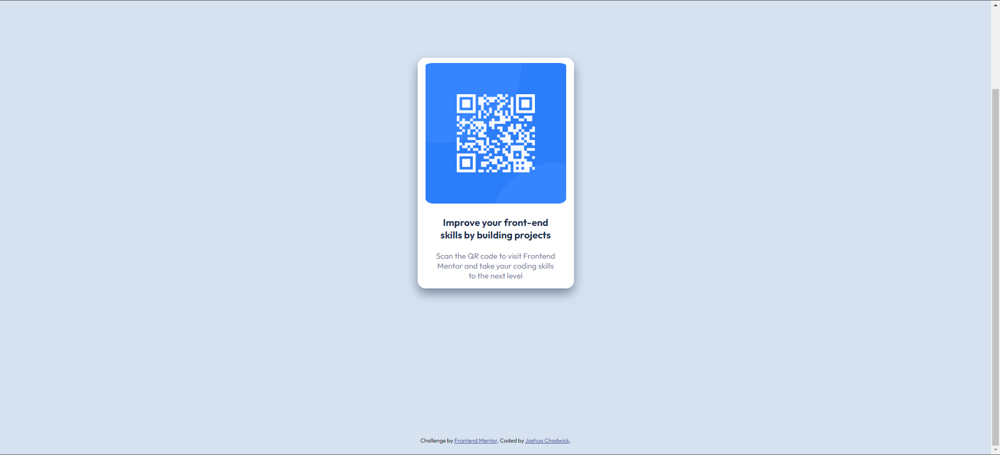

# Frontend Mentor - QR code component solution

This is my solution to the [QR code component challenge on Frontend Mentor](https://www.frontendmentor.io/challenges/qr-code-component-iux_sIO_H). Frontend Mentor challenges help you improve your coding skills by building realistic projects. 

## Table of contents

- [Overview](#overview)
  - [Screenshot](#screenshot)
  - [Links](#links)
- [My process](#my-process)
  - [Built with](#built-with)
  - [What I learned](#what-i-learned)
  - [Continued development](#continued-development)
  - [Useful resources](#useful-resources)
- [Author](#author)

**Note: Delete this note and update the table of contents based on what sections you keep.**

## Overview

### Screenshot

Add a screenshot of your solution. The easiest way to do this is to use Firefox to view your project, right-click the page and select "Take a Screenshot". You can choose either a full-height screenshot or a cropped one based on how long the page is. If it's very long, it might be best to crop it.

Alternatively, you can use a tool like [FireShot](https://getfireshot.com/) to take the screenshot. FireShot has a free option, so you don't need to purchase it. 

Then crop/optimize/edit your image however you like, add it to your project, and update the file path in the image above.

**Note: Delete this note and the paragraphs above when you add your screenshot. If you prefer not to add a screenshot, feel free to remove this entire section.**

### Links

- Solution URL: [Solution](https://www.frontendmentor.io/solutions/qr-code-design-using-htmlcss-3oqrL94kJz)
- Live Site URL: [GitHub Pages Site](https://jdcprograms2017.github.io/QR-Code-FrontendMentor/)

## My process

### Built with

- Semantic HTML5 markup
- CSS custom properties
- Flexbox

**Note: These are just examples. Delete this note and replace the list above with your own choices**

### What I learned

I explored more with Flexbox and how to create inline items within a div to make this nicely stacked design.

### Continued development

I would really like to know more about how to properly size and scale the displayed content for all devices of all screen sizes. That was a big struggle here since I focused mostly on the PC appearance and didn't pay attention to mobile appearance until the last bit.

### Useful resources

- [ChatGPT](https://chat.openai.com) - ChatGPT allows me to ask very specific questions when I need a straightforward answer. It definitely helped me figure out little things like how to make a box-shadow.

## Author

- Frontend Mentor - [@JDCPrograms2k17](https://www.frontendmentor.io/profile/JDCPrograms2k17)
- LinkedIn - [Joshua Chadwick](https://www.linkedin.com/in/joshuadchadwick/)

